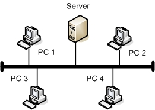

Introducing LAN Topologies

Local Area Network (LAN) Topologies 
Over the years, has been experimentation and implementation of various network designs
In reference to networkin, when we refer to the term "topology", we are actually referring to the design or look of the network 

Star topology

The main premise of a star topology is that devices are individually connected via a central networking device such as a switch or hub
This topology is the most commonly found today because of its trustworthiness and scalability - despite the cost

Any information sent to a device in this topology is sent via the central device to which it connects

Because more cabling and the purchase of dedicated networking equipment is required for this topology, it is more expensive than any of other topologies
However, despite the added cost, this does provide some significant advantages. For example, this topology is much scalable in nature, which means that it is very easy to add more devices as te demand for the network increases

Unfortunately, the more the network scales, the mroe maintenance is required to keep the network functional
This increased dependence on maintenance  can also make troubleshooting faults much harder. Furthermore, the star topology is still prone to failure 
For example, if the centralised hardware that connects device fails, these devices will no longer be able to send or receive data

Bus Topology

This type of connection relies upon a single connection which is known as a backbone cable. This type of topology is similar to the leaf of a tree in the sense that devices(leaves) stem from where the branches are on this cable

Because all data destined for each device travels along the same cable, it is very quickly prone to becoming slow and bottlenecked if devices within the topology are simultaneously requesting data
However, with this said, bus topologies are one of the easier and more cost-efficient topologies to set up because of their expenses, such as cabling or dedicated networking equipment used to connect these devices

Lastly, another disadvantage of the bus topology is that there is little redundancy in place in case of failures. This disadvantage is because there is a single point of failure along the backbone cable. If this cable were to break, devices can no longer receive or transmit data along the bus

Ring Topology

The ring topology (also known as token topology) boasts some similarities. Devices such as computers are connected directly to each other to form a loop, meaning that there is little cabling required and less dependence on dedicated hardware such as within a star topology

A ring topology works by sending data across the loop until it reaches the destined device, using other devices along the loop to forward the data. Interestingly, a device will only send received data from another device in this topology if it does not have any to send itself
If the device happens to have data to send, it will send its own data first before sending data from another device.

Because there is only one direction for data to travel across this topology, it is fairly easy to troubleshoot any faults that arise
However, this is a double-edged sword because it isn't an efficient way of data travelling across a network, as it may have to visit many multiple devices first before reaching the intended device

Lastly, ring topologies are less prone to bottlenecks, such as within a bus topology, as large amounts of traffic are not travelling across the network at any one time. The design of this topology does, however, mean that a fault such as cut cable, or broken device will result in the entire networking breaking

What is a Switch?
Switches are dedicated devices within a network that are designed to aggregate multiple other devices such as computers, printers, or any other networking-capable device using ethernet
These various devices plug into a switch's port. Switches are usually found in larger networks such as businesses, schools, or similar-sized networks, where there are many devices to connect to the network
Switches can connect a large number of devices by having ports of 4, 8, 16, 24, 32, and 64 for devices to plug into

Switches are much more efficient than their lesser counterpart (hubs/repeaters). Switches keep track of what device is connected to which port. This way, when they receive a packet, instead of repeating that packet to every port like a hub would do, it just sends it to the intended target, thus reducing network traffic

What is a Router?
It's a router's job to connect networks and pass data between them. It does this by using routing 

Routing is the label given to the process of data travelling across networks. Routing involves creating a path between networks so that this data can be successfully delivered

Routing is useful when devices are connected by many paths

Both Switches and Routers can be connected to one another
