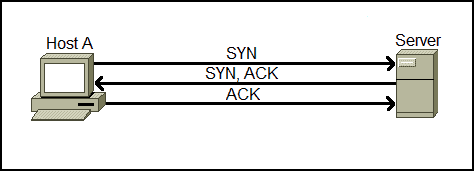

# TCP/IP (The Three-Way Handshake)

**TCP** (Transmission Control Protocol) is a core networking protocol that governs how data is reliably transmitted across networks.

### The TCP/IP Model
The **TCP/IP protocol** is similar to the **OSI model**, consisting of **four layers** that summarize the OSI model's functionality:

1. **Application**  
2. **Transport**  
3. **Internet**  
4. **Network Interface**  

As with the OSI model, information is added to each layer of the TCP/IP model as data traverses it. This process is called **encapsulation**, while the reverse (removing the added information) is called **decapsulation**.

### Connection-Based Protocol
TCP is a **connection-based protocol**, meaning it establishes a connection between a client and a server before transmitting data. This feature guarantees reliable delivery, ensuring all sent data is received on the other end. This process is referred to as the **Three-Way Handshake**, which we’ll discuss in detail shortly.

#### Advantages and Disadvantages of TCP
| **Advantages**                                                                                         | **Disadvantages**                                                                                  |
|-------------------------------------------------------------------------------------------------------|---------------------------------------------------------------------------------------------------|
| Guarantees the integrity of data.                                                                     | Requires a reliable connection between devices. Missing a small chunk of data necessitates a re-send. |
| Synchronizes devices to prevent flooding or incorrect data order.                                     | A slow connection can bottleneck other devices, as the reserved connection remains active.         |
| Performs additional processes to ensure reliability.                                                  | Slower than UDP due to the extra computational work required.                                     |

---

### TCP Headers
When encapsulating data, TCP packets include headers with crucial information for managing the connection and data transmission.

| **Header**                | **Description**                                                                                           |
|---------------------------|-----------------------------------------------------------------------------------------------------------|
| **Source Port**           | The port number chosen by the sender (randomly selected between 0–65535).                                |
| **Destination Port**      | The port number of the application/service on the receiving device (e.g., a webserver running on port 80). |
| **Source IP**             | The IP address of the device sending the packet.                                                         |
| **Destination IP**        | The IP address of the device the packet is destined for.                                                 |
| **Sequence Number**       | A random number assigned to the first piece of data during the connection, ensuring correct data order.   |
| **Acknowledgment Number** | Indicates the sequence number for the next expected piece of data.                                       |
| **Checksum**              | Ensures data integrity. A mismatch in calculated checksum values indicates corruption.                   |
| **Data**                  | The actual data being transmitted (e.g., bytes of a file).                                               |
| **Flag**                  | Determines how the packet is handled during specific processes, such as the handshake or termination.    |

---

### The Three-Way Handshake
The **Three-Way Handshake** establishes a connection between two devices (client and server) using a series of special messages:

| **Step** | **Message** | **Description**                                                                                           |
|----------|-------------|-----------------------------------------------------------------------------------------------------------|
| 1        | **SYN**     | The client sends a **SYN** message to initiate the connection and synchronize with the server.            |
| 2        | **SYN/ACK** | The server responds with **SYN/ACK**, acknowledging the client's synchronization attempt.                 |
| 3        | **ACK**     | The client (or server) sends **ACK**, confirming receipt of the synchronization messages.                 |
| 4        | **DATA**    | Once connected, data transmission begins using the "DATA" message.                                        |
| 5        | **FIN**     | Sent to cleanly terminate the connection.                                                                |
| #        | **RST**     | Used as a last resort to abruptly terminate communication due to errors or system faults.                |

#### Sequence Numbers
Each piece of data is assigned a random **Sequence Number** to ensure data is received in the correct order. This order is established during the handshake:

1. **Client (SYN)**: "Here’s my Initial Sequence Number (ISN): `0`."
2. **Server (SYN/ACK)**: "Here’s my ISN: `5000`. I acknowledge your ISN: `0`."
3. **Client (ACK)**: "I acknowledge your ISN: `5000`. Here’s some data starting at `0+1`."

---

### Closing a TCP Connection
TCP connections are closed once all data has been successfully transmitted. Since TCP reserves system resources, it’s best practice to terminate connections promptly.

#### Closing Steps
1. A device initiates the closure by sending a **FIN** packet.
2. The receiving device acknowledges the closure by responding with an **ACK**.
3. Both devices ensure no remaining data needs to be transmitted before fully terminating the connection.

#### Abrupt Termination
If an error occurs, a **RST** packet can be sent to immediately terminate the connection. This indicates a failure, such as a malfunctioning application or insufficient system resources.
