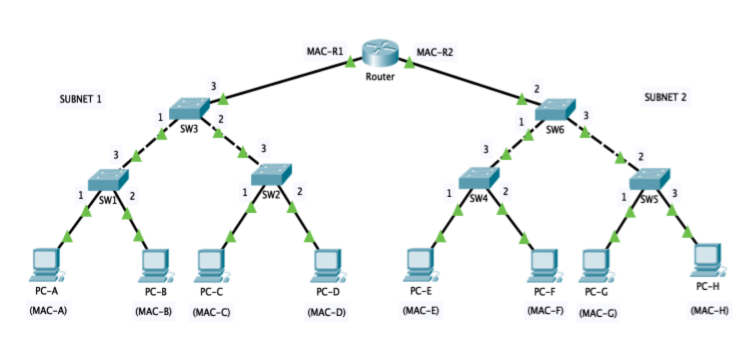

# A Mini Intro on Subnetting

Subnetting is the term given to splitting up a network into smaller, miniature networks within itself. Think of it as slicing up a cake for your friends. There's only a certain amount of cake to go around, but everybody wants a piece. Subnetting is you deciding who gets what slice & reserving such a slice of this metaphorical cake.

Take a business, for example; you will have different departments such as:
- Accounting (subnet 1)
- Finance (subnet 2)



Whereas you know where to send information in real life to the correct department, networks need to know as well. Network administrators use subnetting to categorize and assign specific parts of a network to reflect this.

Subnetting is achieved by splitting up the number of hosts that can fit within the network, represented by a number called a **subnet mask**.

```
192.168.1.1
```

As we can recall, an IP address is made up of four sections called **octets**. The same goes for a subnet mask, which is also represented as a number of four bytes (32 bits), ranging from 0 to 255 (0-255).

Subnets use IP addresses in three different ways:
- **Identify the network address**
- **Identify the host address**
- **Identify the default gateway**

### Let's split these three up to understand their purposes:

| **Type**           | **Purpose**                                                                                                   | **Example**         |
|---------------------|-------------------------------------------------------------------------------------------------------------|---------------------|
| **Network Address** | This address identifies the start of the actual network and is used to identify a network's existence        | 192.168.1.0         |
| **Host Address**    | An IP address here is used to identify a device on the subnet                                                | 192.168.1.100       |
| **Default Gateway** | The default gateway address is the designated address of a network device that enables communication with devices on other networks. | 192.168.1.254       |

Now, in small networks such as at home, you will be on one subnet as there is an unlikely chance that you need more than 254 devices connected at one time. However, places such as businesses and offices will have much more of these devices (PCs, printers, cameras...), where subnetting takes place.

### Subnetting provides a range of benefits, including:
- Efficiency
- Security
- Full control

Let's take the typical café on the street. This café will have two networks:
- One for employees, cash registers, and other devices for the facility
- One for the general public to use as a hotspot.
