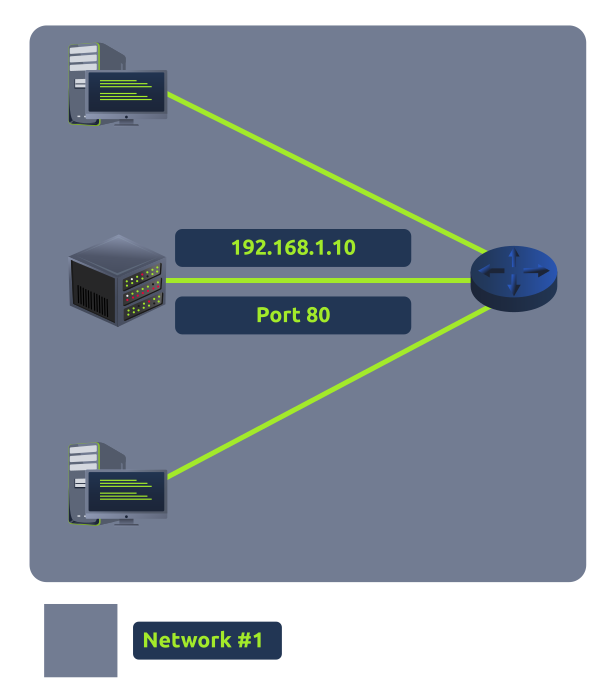
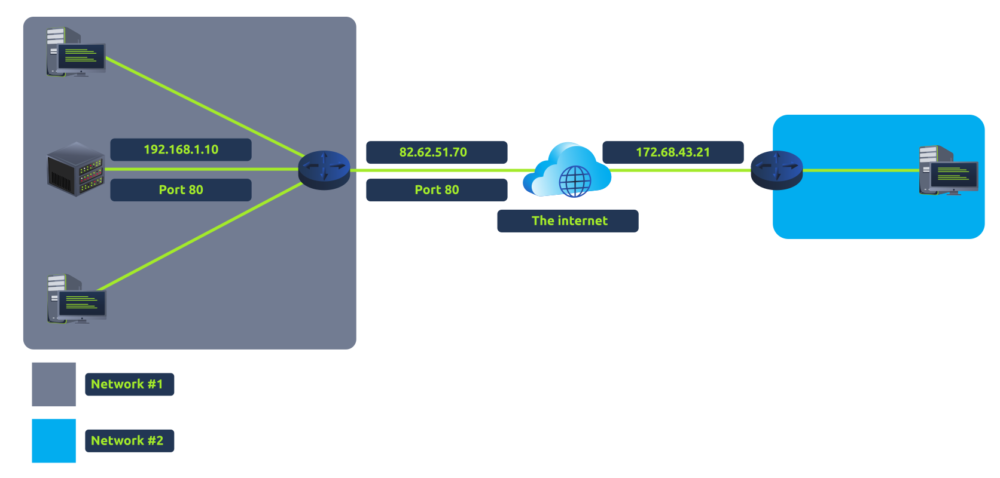
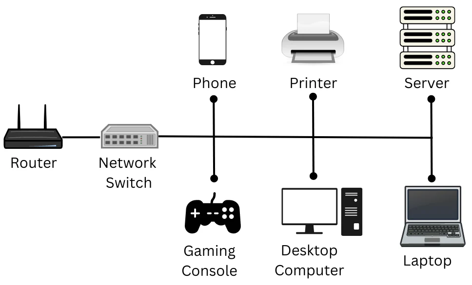
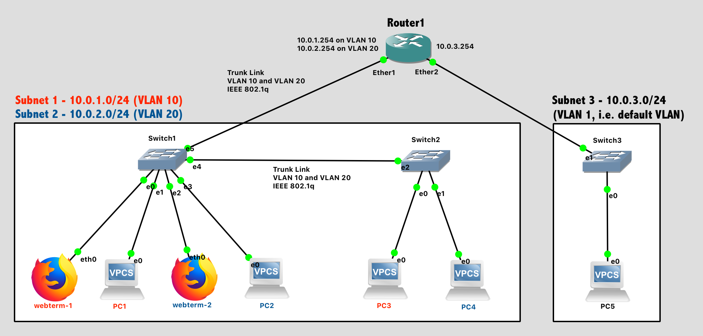

# Networking Basics  

---

## Port Forwarding  
Port forwarding is essential for connecting applications and services to the internet. Without it, applications such as web servers are only accessible to devices within the same local network (intranet).  

### Example of Port Forwarding  
In the diagram below, a server with an IP address of `192.168.1.10` runs a web server on port 80. Without port forwarding, only the devices within the same network can access this server.  

  

If the administrator wants to make the server accessible to the public (over the internet), port forwarding is implemented, as shown here:  

  

Now, devices on Network #2 can access the web server on Network #1 using the public IP address `82.62.51.70`.  

### Port Forwarding vs. Firewalls  
- **Port Forwarding:** Opens specific ports on a router, allowing traffic to reach particular devices within the network.  
- **Firewalls:** Determine whether traffic can pass through open ports based on predefined rules.  

> **Note:** Port forwarding is configured on the router of a network.  

---

## Firewalls  
A **firewall** is a network device responsible for controlling incoming and outgoing traffic. Think of it as the border security of a network.  

### Firewall Functionality  
Firewalls decide whether to permit or deny traffic based on factors like:  
1. **Source:** Where the traffic is coming from.  
2. **Destination:** Where the traffic is headed.  
3. **Port:** Which port the traffic is targeting.  
4. **Protocol:** The protocol used (e.g., UDP or TCP).  

Firewalls use **packet inspection** to analyze traffic and make decisions.  

### Types of Firewalls  
| **Type**     | **Description**                                                                                                           |
|--------------|---------------------------------------------------------------------------------------------------------------------------|
| **Stateful** | Uses the entire connection's data to make decisions. Dynamic but resource-intensive. Blocks devices sending malicious data.|
| **Stateless**| Uses static rules to evaluate individual packets. Lightweight but less flexible. Useful for mitigating high-traffic attacks.|

  

---

## VPN Basics  
A **Virtual Private Network (VPN)** creates a secure, encrypted connection (tunnel) between devices on separate networks, forming a private network.  

### VPN Example  
Consider the following networks:  
1. **Network #1 (Office #1)**  
2. **Network #2 (Office #2)**  
3. **Network #3**: A private network formed by devices connected via a VPN.  

  

Devices on Network #3 are part of both Network #1 and Network #2 but communicate securely over their private VPN.  

### Benefits of VPNs  
| **Benefit**                             | **Description**                                                                                       |
|----------------------------------------|-------------------------------------------------------------------------------------------------------|
| **Connects Remote Networks**           | Useful for businesses with multiple offices to share resources like servers and infrastructure.       |
| **Offers Privacy**                     | Encrypts data, protecting it from interception (e.g., on public WiFi).                                |
| **Provides Anonymity**                 | Protects against tracking by ISPs or governments, especially for journalists or activists.            |

### VPN Technologies  
| **Technology** | **Description**                                                                                                           |
|----------------|---------------------------------------------------------------------------------------------------------------------------|
| **PPP**        | Encrypts and authenticates data using private keys and certificates. Non-routable by itself.                             |
| **PPTP**       | Allows data from PPP to travel across networks. Easy to set up but weak encryption.                                      |
| **IPSec**      | Strong encryption using the IP framework. Harder to configure but widely supported.                                      |

> **Note:** PPP provides encryption and authentication but does not allow data to leave the network independently.  

---

## LAN Networking Devices  

### Routers  
A **router** connects networks and routes data between them. Routers operate at Layer 3 of the OSI model and use **routing protocols** to determine the best path for data based on factors like:  
- Shortest path  
- Reliability  
- Speed (e.g., fiber vs. copper connections)  

Routers can also be configured for tasks such as port forwarding or firewall management.  

---

### Switches  
A **switch** is a networking device that connects multiple devices within the same network.  

#### Layer 2 Switches  
- Operate at Layer 2 of the OSI model.  
- Forward frames to devices using their MAC addresses.  
- Do not route packets between networks.  

  

#### Layer 3 Switches  
- Operate at Layer 3 of the OSI model.  
- Combine functionalities of Layer 2 switches and routers by forwarding frames and routing packets using IP addresses.  

#### VLAN (Virtual Local Area Network)  
VLANs allow devices in the same network to be virtually separated for security and management purposes. VLANs enable shared resources like internet connections while maintaining strict communication rules between devices.  

  

---

This guide provides a foundational understanding of key networking concepts like port forwarding, firewalls, VPNs, and networking devices. Each section builds towards a deeper grasp of how data is transmitted securely and efficiently across networks.
