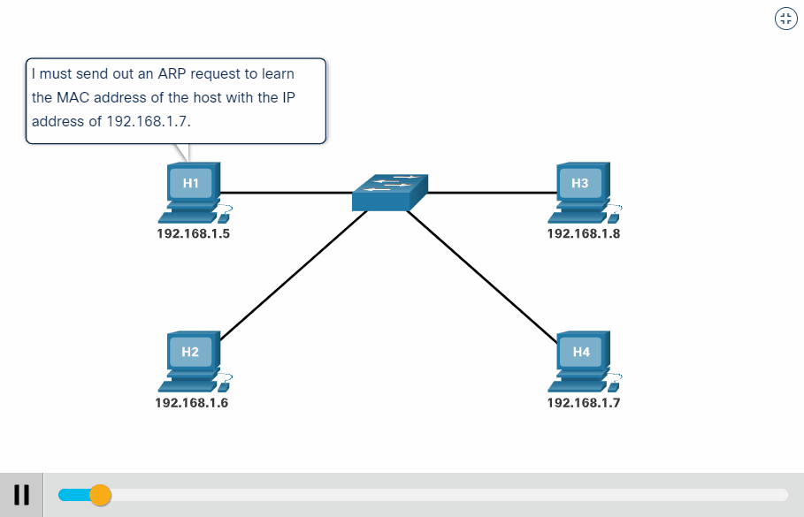

# Understanding ARP (Address Resolution Protocol)

Devices on a network can have two identifiers: a **MAC address** and an **IP address**. The **Address Resolution Protocol (ARP)** is the technology responsible for allowing devices to identify each other on a network.

Simply put, ARP enables a device to associate its MAC address with its IP address on the network. Every device keeps a record of the MAC addresses associated with other devices, making it possible for communication to occur.

When devices wish to communicate with one another, they send a broadcast message to the entire network, searching for the specific device. ARP helps devices find the MAC address (and therefore the physical identifier) of the device they wish to communicate with.

## How Does ARP Work?

Each device in a network maintains a **cache**, which stores information about the identifiers of other devices. In the case of ARP, this cache maps IP addresses to MAC addresses.

To associate these two identifiers, ARP uses two types of messages:

### 1. ARP Request

An ARP request is broadcasted to the network, asking, "What is the MAC address that owns this IP address?" Devices that do not own the IP address will ignore the request. The device that owns the IP address will send a response with its MAC address.

### 2. ARP Reply

When the device that owns the IP address receives the ARP request, it sends an ARP reply containing its MAC address. The requesting device can then store this information in its ARP cache for future communication.

